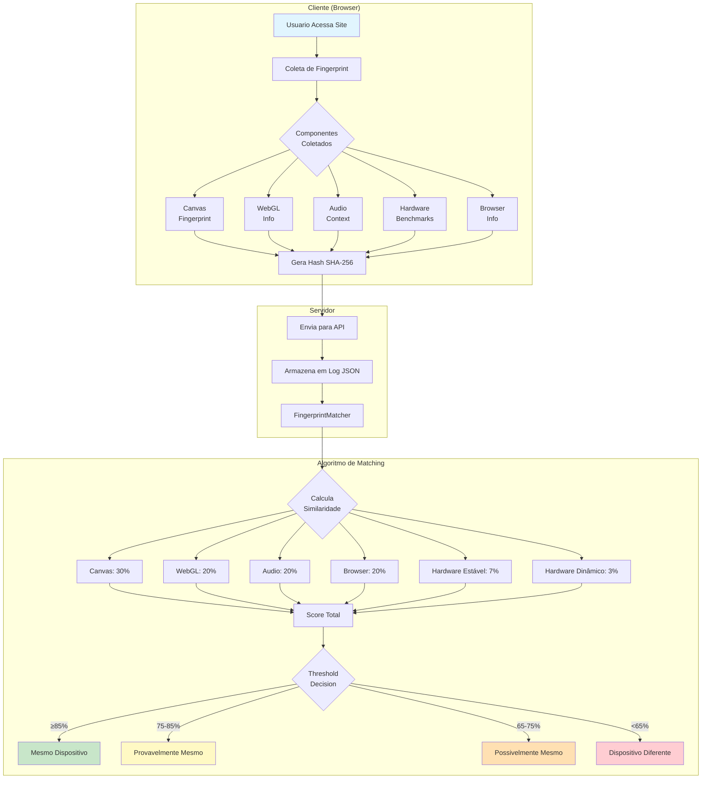
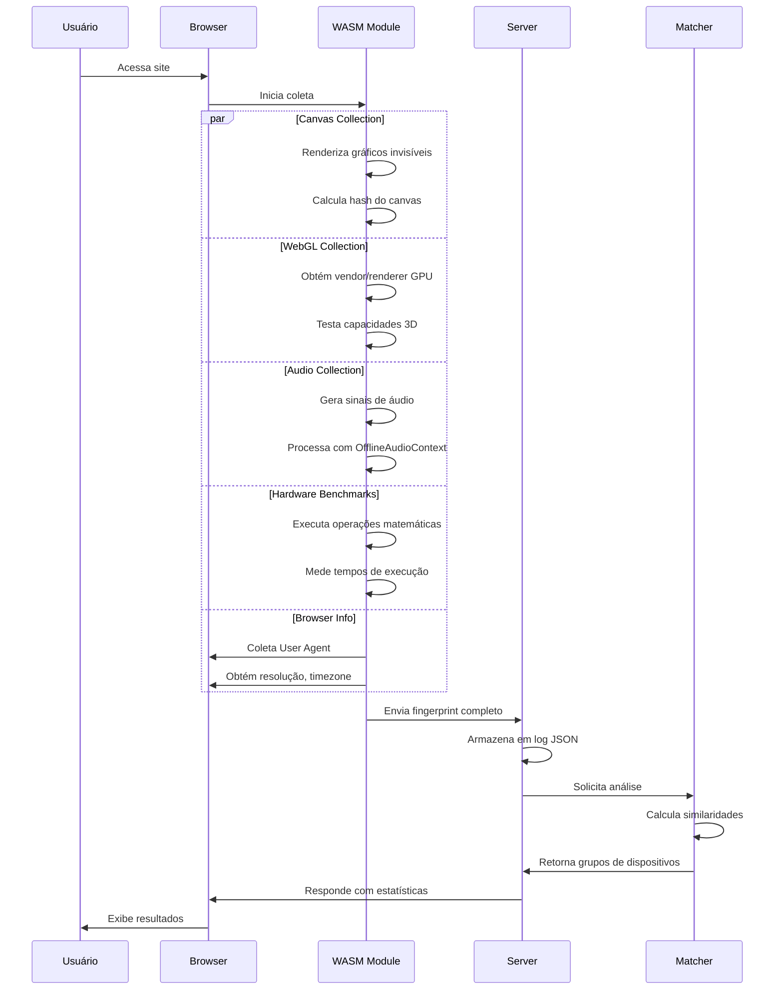
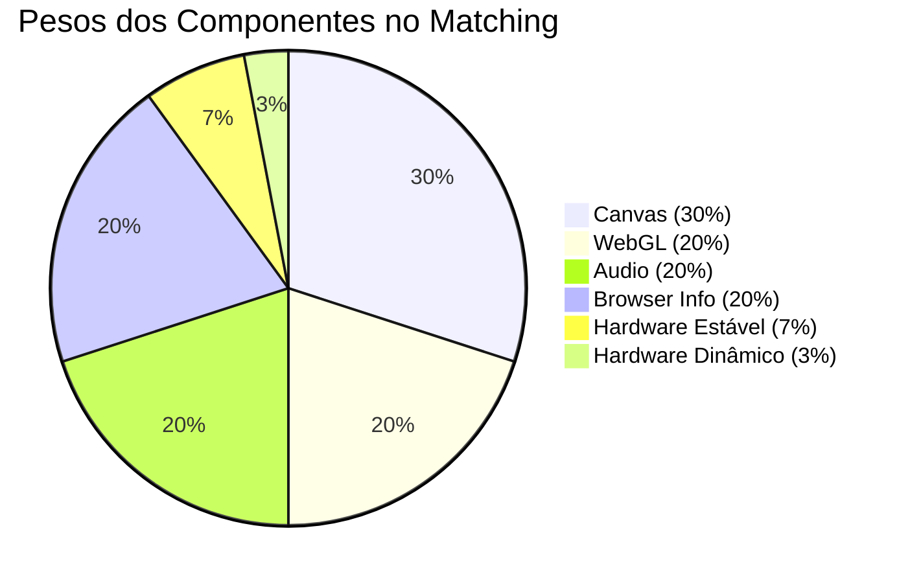
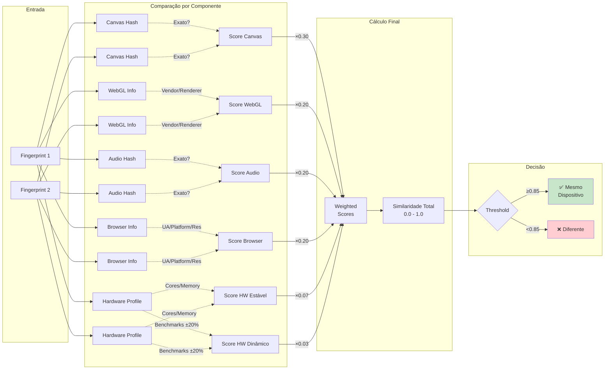
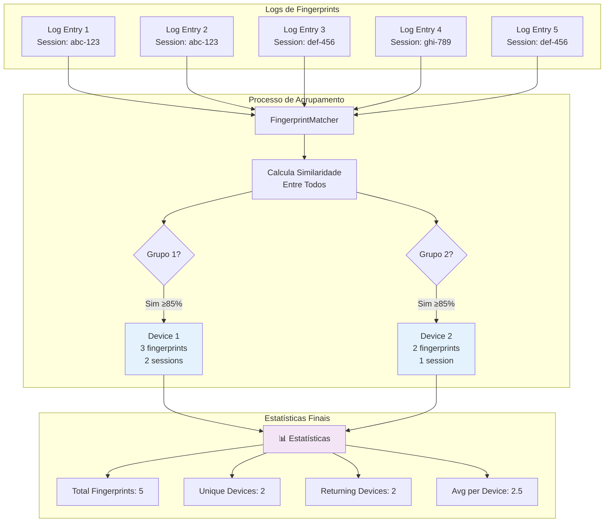
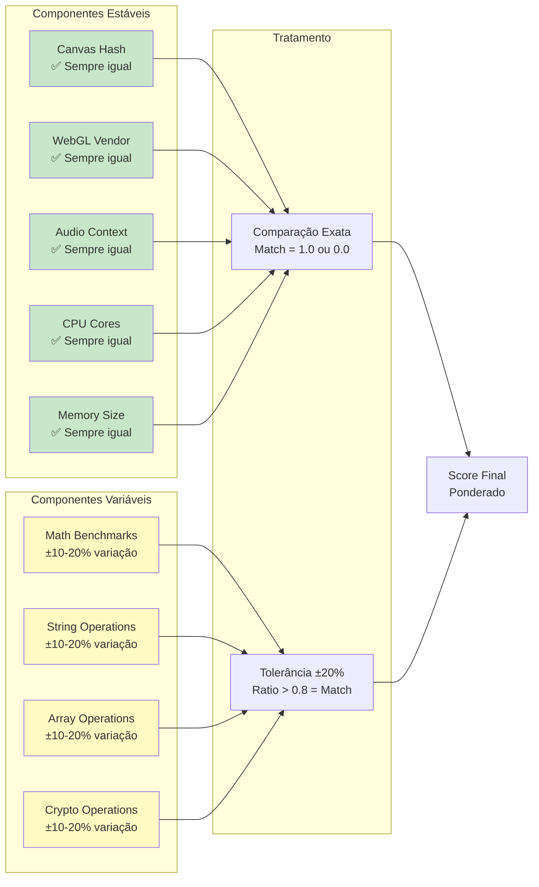
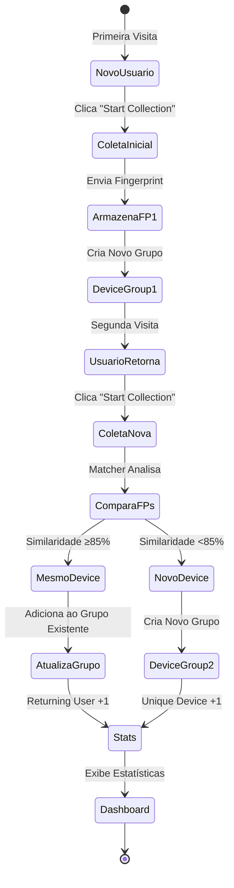
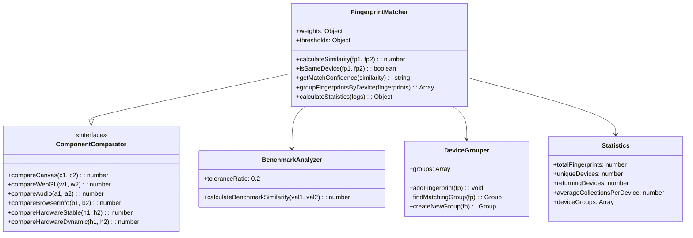
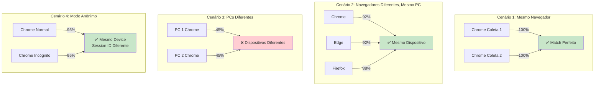

# Sistema de Fingerprinting Inteligente - Diagrama

## Visão Geral do Sistema

## Fluxo de Coleta de Dados

## Componentes e Pesos do Matching

## Algoritmo de Similaridade

## Agrupamento de Dispositivos

## Tolerância a Variações

## Casos de Uso

## Arquitetura de Implementação

## Resultados Esperados

---

Este diagrama documenta completamente o Sistema de Fingerprinting Inteligente, mostrando:

1. **Fluxo de coleta** de dados do browser
2. **Algoritmo de matching** com pesos e thresholds
3. **Processo de agrupamento** de dispositivos
4. **Tolerância a variações** em benchmarks
5. **Casos de uso** e cenários esperados
6. **Arquitetura** das classes implementadas

O sistema identifica dispositivos únicos através de fingerprinting, cumprindo o objetivo da pesquisa acadêmica de rastrear usuários sem depender de cookies ou IDs de sessão.