# Sistema de Fingerprinting Inteligente - Diagrama

## Visão Geral do Sistema

```mermaid
graph TB
    subgraph "Cliente (Browser)"
        A[Usuario Acessa Site] --> B[Coleta de Fingerprint]
        B --> C{Componentes<br/>Coletados}
        C --> D[Canvas<br/>Fingerprint]
        C --> E[WebGL<br/>Info]
        C --> F[Audio<br/>Context]
        C --> G[Hardware<br/>Benchmarks]
        C --> H[Browser<br/>Info]

        D --> I[Gera Hash SHA-256]
        E --> I
        F --> I
        G --> I
        H --> I
    end

    subgraph "Servidor"
        I --> J[Envia para API]
        J --> K[Armazena em Log JSON]
        K --> L[FingerprintMatcher]
    end

    subgraph "Algoritmo de Matching"
        L --> M{Calcula<br/>Similaridade}
        M --> N[Canvas: 30%]
        M --> O[WebGL: 20%]
        M --> P[Audio: 20%]
        M --> Q[Browser: 20%]
        M --> R[Hardware Estável: 7%]
        M --> S[Hardware Dinâmico: 3%]

        N --> T[Score Total]
        O --> T
        P --> T
        Q --> T
        R --> T
        S --> T

        T --> U{Threshold<br/>Decision}
        U -->|≥85%| V[Mesmo Dispositivo]
        U -->|75-85%| W[Provavelmente Mesmo]
        U -->|65-75%| X[Possivelmente Mesmo]
        U -->|<65%| Y[Dispositivo Diferente]
    end

    style A fill:#e1f5fe
    style V fill:#c8e6c9
    style W fill:#fff9c4
    style X fill:#ffe0b2
    style Y fill:#ffcdd2
```

## Fluxo de Coleta de Dados

```mermaid
sequenceDiagram
    participant U as Usuário
    participant B as Browser
    participant W as WASM Module
    participant S as Server
    participant M as Matcher

    U->>B: Acessa site
    B->>W: Inicia coleta

    par Canvas Collection
        W->>W: Renderiza gráficos invisíveis
        W->>W: Calcula hash do canvas
    and WebGL Collection
        W->>W: Obtém vendor/renderer GPU
        W->>W: Testa capacidades 3D
    and Audio Collection
        W->>W: Gera sinais de áudio
        W->>W: Processa com OfflineAudioContext
    and Hardware Benchmarks
        W->>W: Executa operações matemáticas
        W->>W: Mede tempos de execução
    and Browser Info
        W->>B: Coleta User Agent
        W->>B: Obtém resolução, timezone
    end

    W->>S: Envia fingerprint completo
    S->>S: Armazena em log JSON
    S->>M: Solicita análise
    M->>M: Calcula similaridades
    M->>S: Retorna grupos de dispositivos
    S->>B: Responde com estatísticas
    B->>U: Exibe resultados
```

## Componentes e Pesos do Matching

## Algoritmo de Similaridade

## Agrupamento de Dispositivos

```mermaid
graph TD
    subgraph "Logs de Fingerprints"
        L1[Log Entry 1<br/>Session: abc-123]
        L2[Log Entry 2<br/>Session: abc-123]
        L3[Log Entry 3<br/>Session: def-456]
        L4[Log Entry 4<br/>Session: ghi-789]
        L5[Log Entry 5<br/>Session: def-456]
    end

    subgraph "Processo de Agrupamento"
        L1 --> M[FingerprintMatcher]
        L2 --> M
        L3 --> M
        L4 --> M
        L5 --> M

        M --> CALC[Calcula Similaridade<br/>Entre Todos]

        CALC --> G1{Grupo 1?}
        CALC --> G2{Grupo 2?}

        G1 -->|Sim ≥85%| D1[Device 1<br/>3 fingerprints<br/>2 sessions]
        G2 -->|Sim ≥85%| D2[Device 2<br/>2 fingerprints<br/>1 session]
    end

    subgraph "Estatísticas Finais"
        D1 --> STATS[📊 Estatísticas]
        D2 --> STATS

        STATS --> R1[Total Fingerprints: 5]
        STATS --> R2[Unique Devices: 2]
        STATS --> R3[Returning Devices: 2]
        STATS --> R4[Avg per Device: 2.5]
    end

    style D1 fill:#e3f2fd
    style D2 fill:#e3f2fd
    style STATS fill:#f3e5f5
```

## Tolerância a Variações

```mermaid
graph LR
    subgraph "Componentes Estáveis"
        direction TB
        CS1[Canvas Hash<br/>✅ Sempre igual]
        CS2[WebGL Vendor<br/>✅ Sempre igual]
        CS3[Audio Context<br/>✅ Sempre igual]
        CS4[CPU Cores<br/>✅ Sempre igual]
        CS5[Memory Size<br/>✅ Sempre igual]
    end

    subgraph "Componentes Variáveis"
        direction TB
        CV1[Math Benchmarks<br/>±10-20% variação]
        CV2[String Operations<br/>±10-20% variação]
        CV3[Array Operations<br/>±10-20% variação]
        CV4[Crypto Operations<br/>±10-20% variação]
    end

    subgraph "Tratamento"
        CS1 --> E[Comparação Exata<br/>Match = 1.0 ou 0.0]
        CS2 --> E
        CS3 --> E
        CS4 --> E
        CS5 --> E

        CV1 --> T[Tolerância ±20%<br/>Ratio > 0.8 = Match]
        CV2 --> T
        CV3 --> T
        CV4 --> T
    end

    E --> F[Score Final<br/>Ponderado]
    T --> F

    style CS1 fill:#c8e6c9
    style CS2 fill:#c8e6c9
    style CS3 fill:#c8e6c9
    style CS4 fill:#c8e6c9
    style CS5 fill:#c8e6c9
    style CV1 fill:#fff9c4
    style CV2 fill:#fff9c4
    style CV3 fill:#fff9c4
    style CV4 fill:#fff9c4
```

## Casos de Uso

## Arquitetura de Implementação

## Resultados Esperados

```mermaid
graph TD
    subgraph "Cenário 1: Mesmo Navegador"
        A1[Chrome Coleta 1] -->|100%| R1[✅ Match Perfeito]
        A2[Chrome Coleta 2] -->|100%| R1
    end

    subgraph "Cenário 2: Navegadores Diferentes, Mesmo PC"
        B1[Chrome] -->|92%| R2[✅ Mesmo Dispositivo]
        B2[Edge] -->|92%| R2
        B3[Firefox] -->|88%| R2
    end

    subgraph "Cenário 3: PCs Diferentes"
        C1[PC 1 Chrome] -->|45%| R3[❌ Dispositivos Diferentes]
        C2[PC 2 Chrome] -->|45%| R3
    end

    subgraph "Cenário 4: Modo Anônimo"
        D1[Chrome Normal] -->|95%| R4[✅ Mesmo Device<br/>Session ID Diferente]
        D2[Chrome Incógnito] -->|95%| R4
    end

    style R1 fill:#c8e6c9
    style R2 fill:#c8e6c9
    style R3 fill:#ffcdd2
    style R4 fill:#c8e6c9
```

---

Este diagrama documenta completamente o Sistema de Fingerprinting Inteligente, mostrando:

1. **Fluxo de coleta** de dados do browser
2. **Algoritmo de matching** com pesos e thresholds
3. **Processo de agrupamento** de dispositivos
4. **Tolerância a variações** em benchmarks
5. **Casos de uso** e cenários esperados
6. **Arquitetura** das classes implementadas

O sistema identifica dispositivos únicos através de fingerprinting, cumprindo o objetivo da pesquisa acadêmica de rastrear usuários sem depender de cookies ou IDs de sessão.