# Sistema de Matching Inteligente - Documentação Visual

## 1. Visão Geral do Sistema de Matching

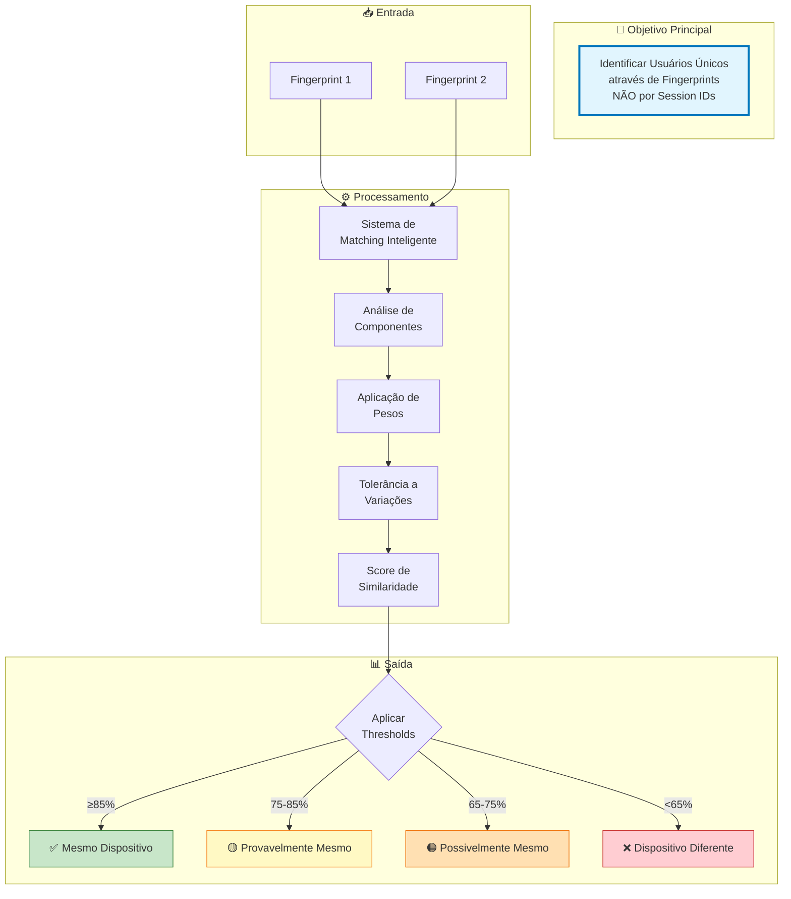

## 2. Componentes e Seus Pesos

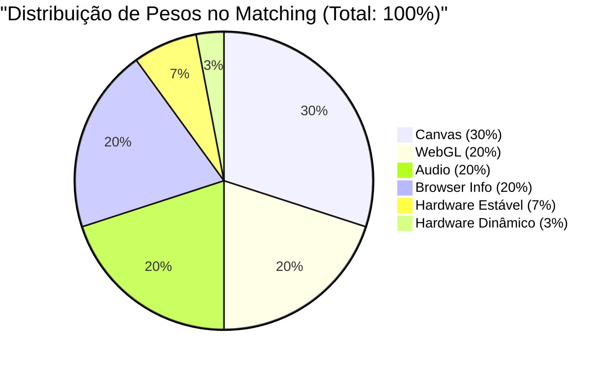

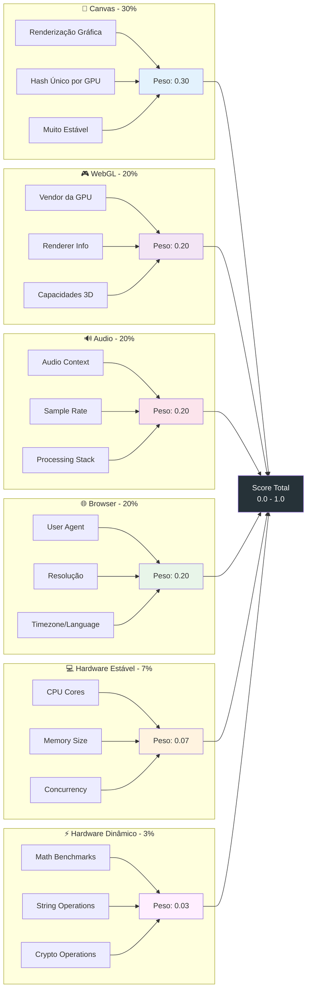

## 3. Sistema de Thresholds

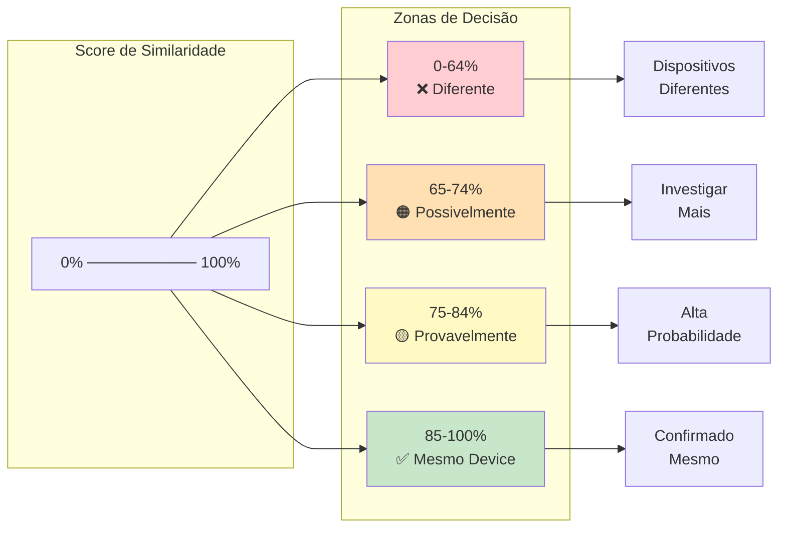

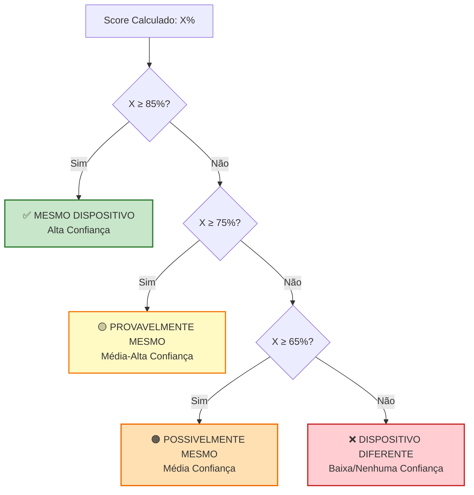

## 4. Tolerância a Variações (±20%)

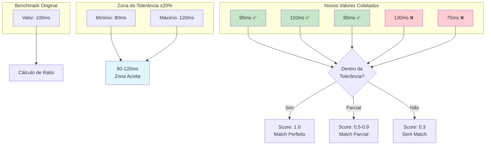

## 5. Funcionalidades do Sistema

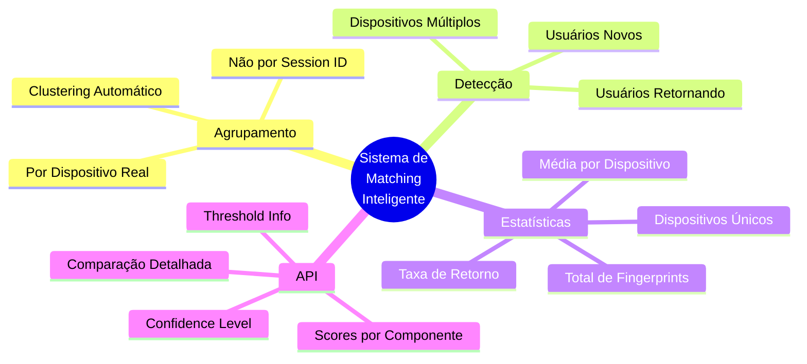

## 6. Fluxo de Agrupamento por Dispositivo

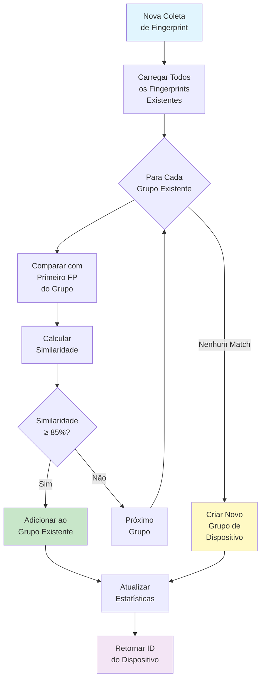

## 7. API de Comparação

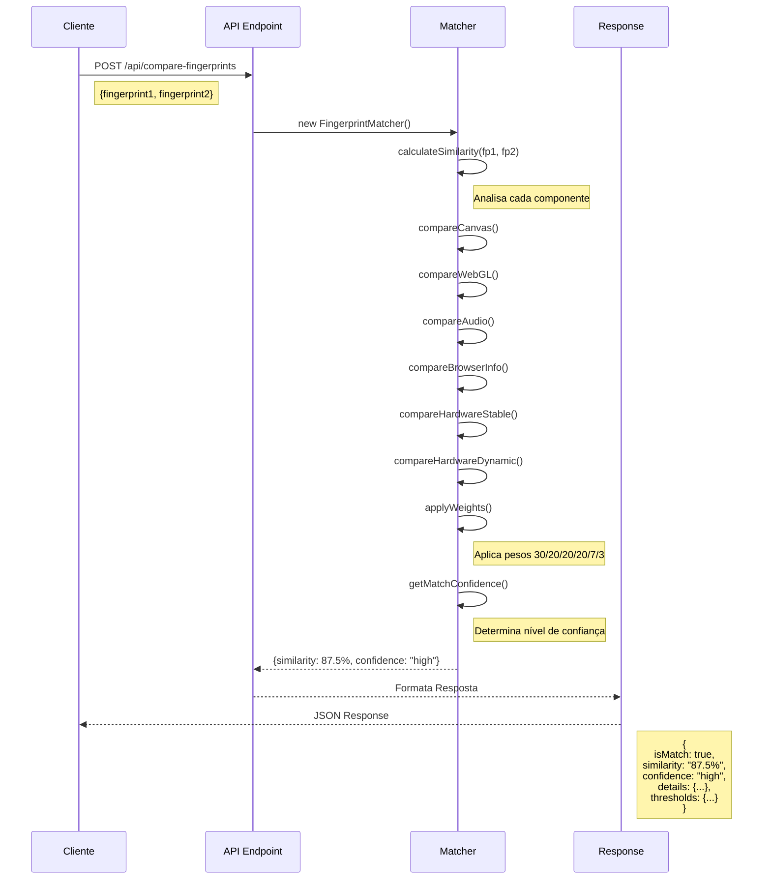

## 8. Casos de Uso Reais

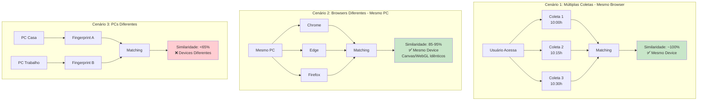

## 9. Estatísticas Geradas

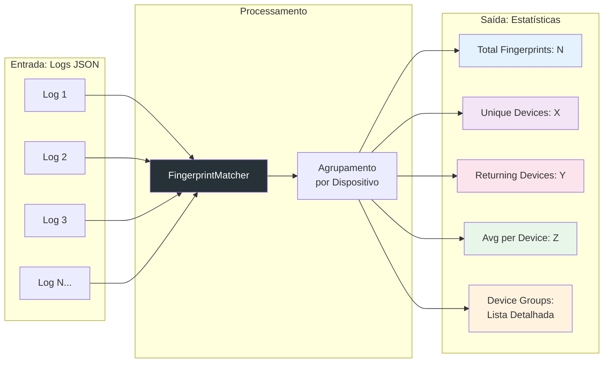

## 10. Vantagens do Sistema

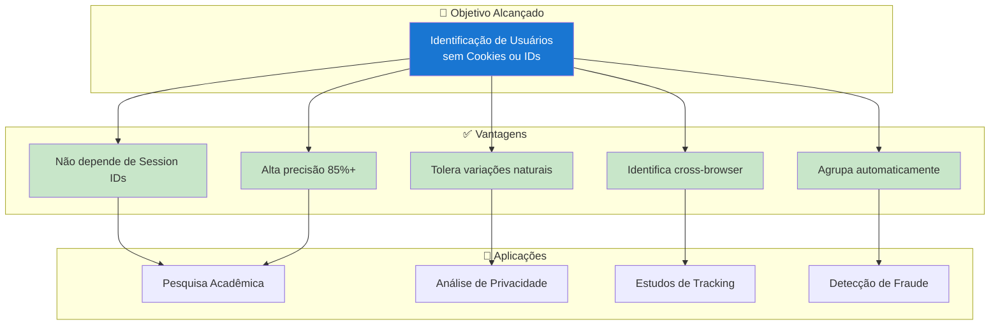

---

## Resumo do Sistema

O **Sistema de Matching Inteligente** representa uma evolução significativa no campo de browser fingerprinting, implementando:

1. **Identificação por Fingerprint**: Não depende de Session IDs ou cookies
2. **Algoritmo Ponderado**: Pesos calibrados para cada componente (30/20/20/20/7/3)
3. **Tolerância Inteligente**: Aceita variações de ±20% em benchmarks
4. **Thresholds Claros**: 85%+ = mesmo device, <65% = diferente
5. **Agrupamento Automático**: Organiza fingerprints por dispositivo real
6. **API Rica**: Fornece detalhes completos de comparação

Este sistema cumpre o objetivo acadêmico de demonstrar como técnicas avançadas de fingerprinting podem identificar usuários únicos de forma confiável, mesmo com variações naturais nos dados coletados.