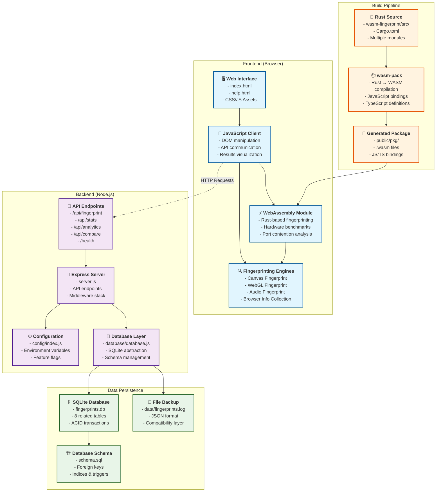
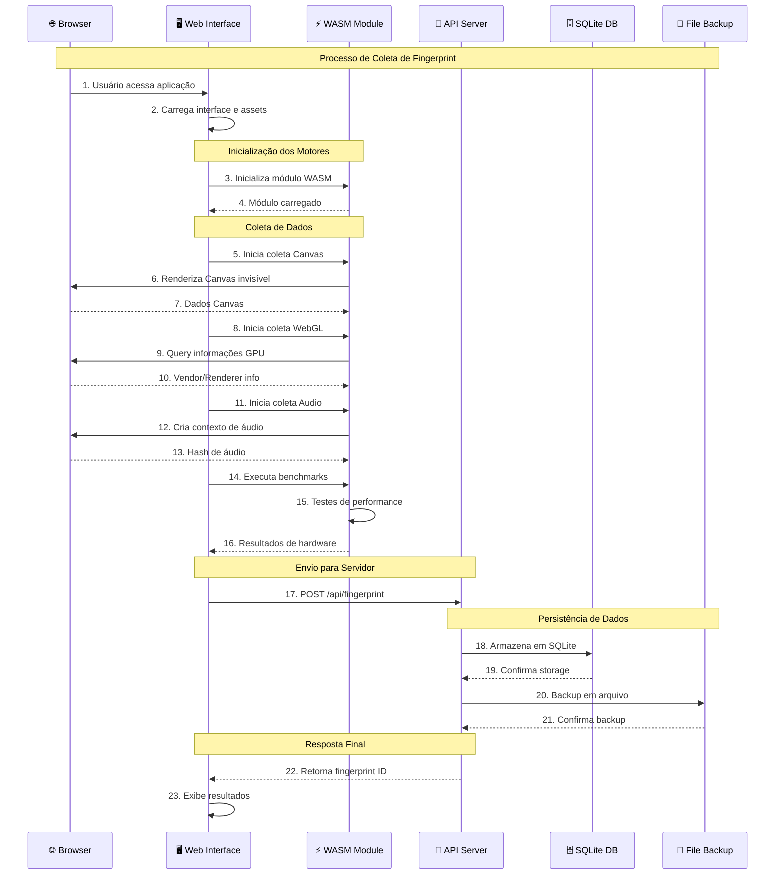
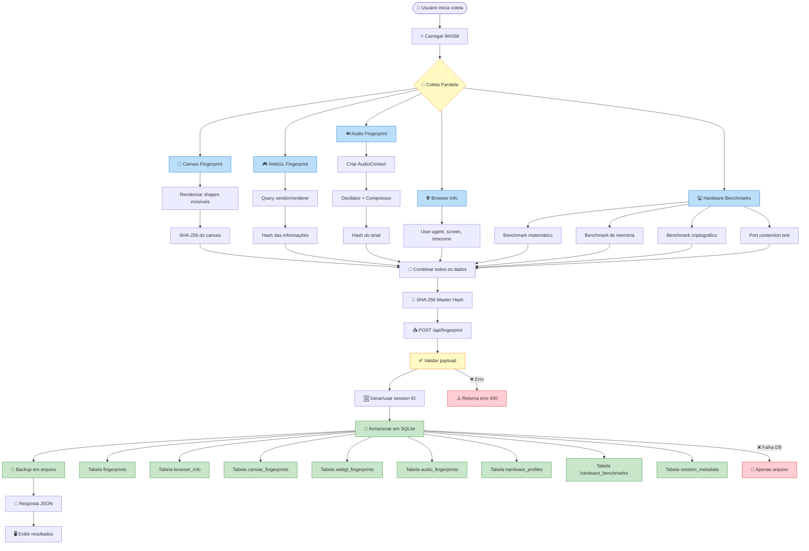
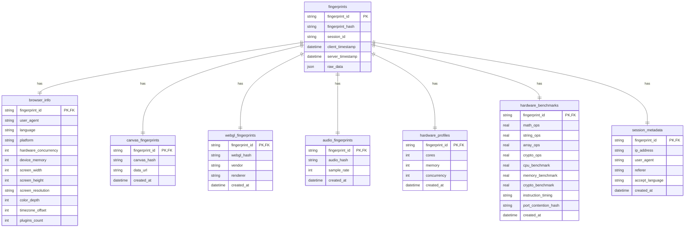

# Sistema de Browser Fingerprinting - Arquitetura e Pipeline

## Diagrama da Arquitetura Completa



## Pipeline de Coleta de Fingerprint



## Fluxo de Dados Detalhado



## Estrutura de Dados do Fingerprint



## Tecnologias e Componentes

### Frontend Stack
- **HTML5/CSS3**: Interface moderna e responsiva
- **Vanilla JavaScript**: Lógica de cliente sem frameworks
- **WebAssembly (Rust)**: Computação de alta performance
- **Web APIs**: Canvas, WebGL, Web Audio, Performance

### Backend Stack
- **Node.js**: Runtime JavaScript no servidor
- **Express.js**: Framework web minimalista
- **SQLite**: Banco de dados embarcado
- **Body Parser/CORS**: Middleware de segurança

### Build Tools
- **Rust/Cargo**: Compilação do código WASM
- **wasm-pack**: Geração de bindings JavaScript
- **npm**: Gerenciamento de dependências Node.js

### Recursos de Segurança
- **COOP/COEP Headers**: Isolamento de origem cruzada
- **Rate Limiting**: Proteção contra spam
- **CORS**: Controle de acesso cross-origin
- **Input Validation**: Sanitização de dados

### Estrutura de Arquivos
```
wasm-finger/
├── 📁 public/              # Assets estáticos
│   ├── 📄 index.html       # Interface principal
│   ├── 📄 help.html        # Documentação
│   └── 📁 pkg/             # WASM gerado
├── 📁 wasm-fingerprint/    # Código Rust
│   ├── 📄 Cargo.toml       # Dependências Rust
│   └── 📁 src/             # Módulos fingerprinting
├── 📁 database/            # Camada de dados
│   ├── 📄 schema.sql       # Estrutura do DB
│   └── 📄 database.js      # Abstração SQLite
├── 📁 config/              # Configurações
│   └── 📄 index.js         # Config centralizada
├── 📁 data/                # Backup em arquivos
├── 📄 server.js            # Servidor Express
└── 📄 package.json         # Dependências Node.js
```