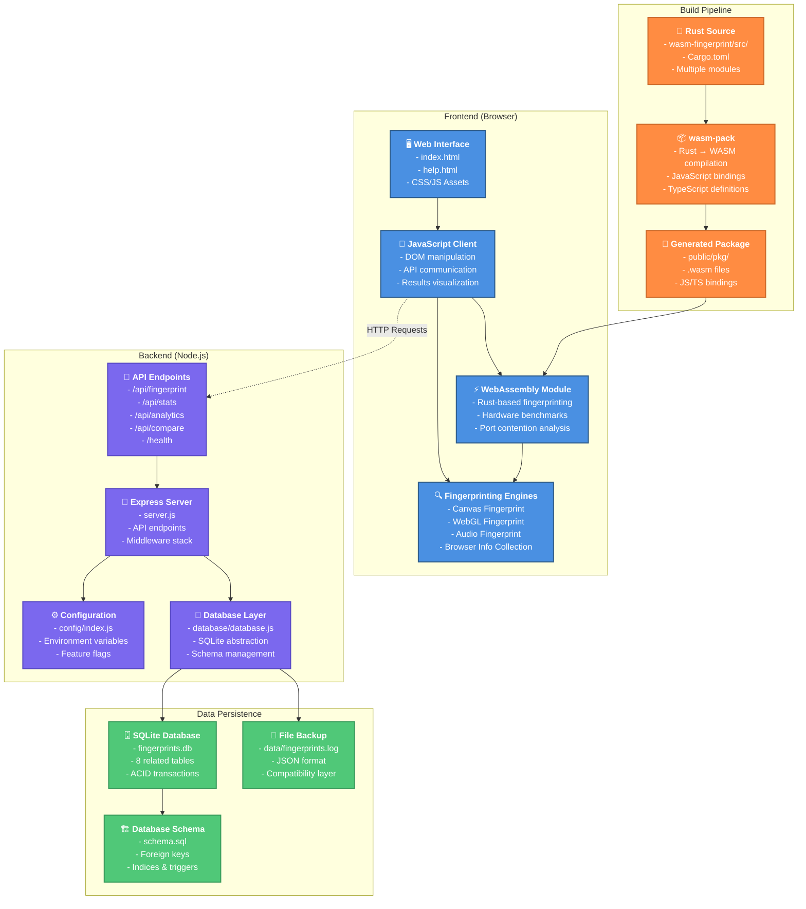
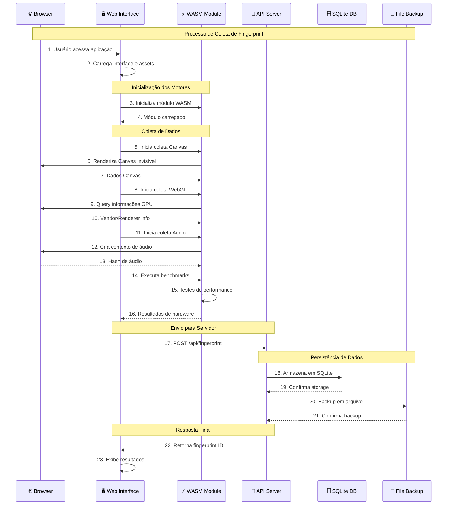
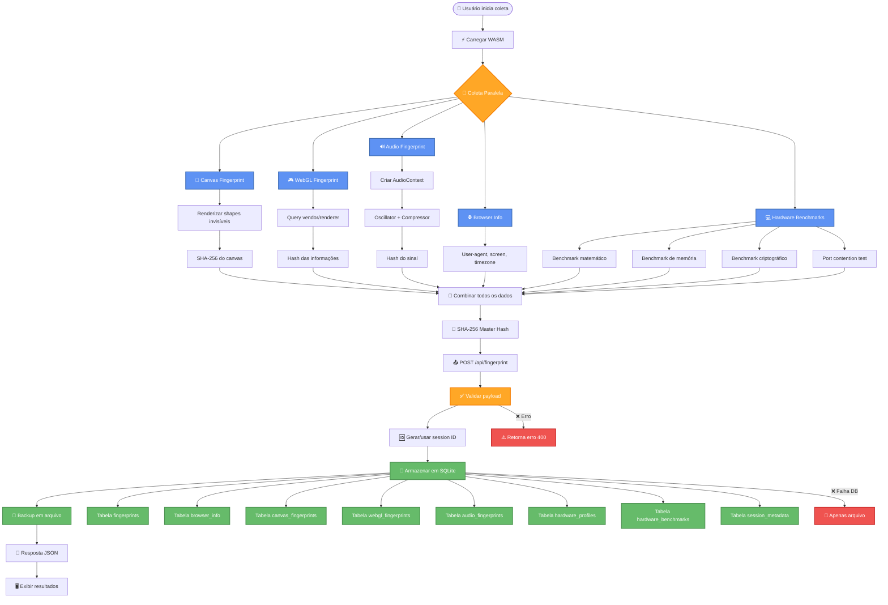
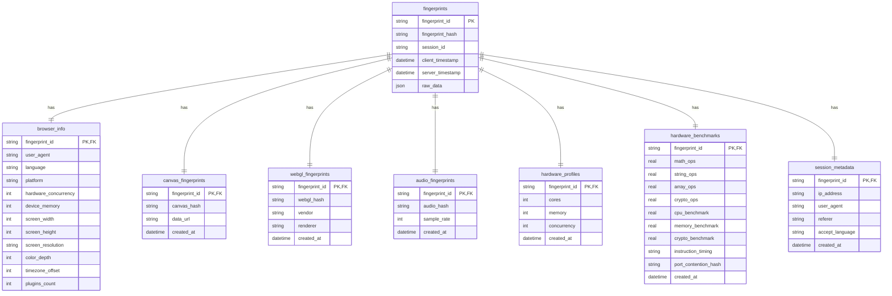
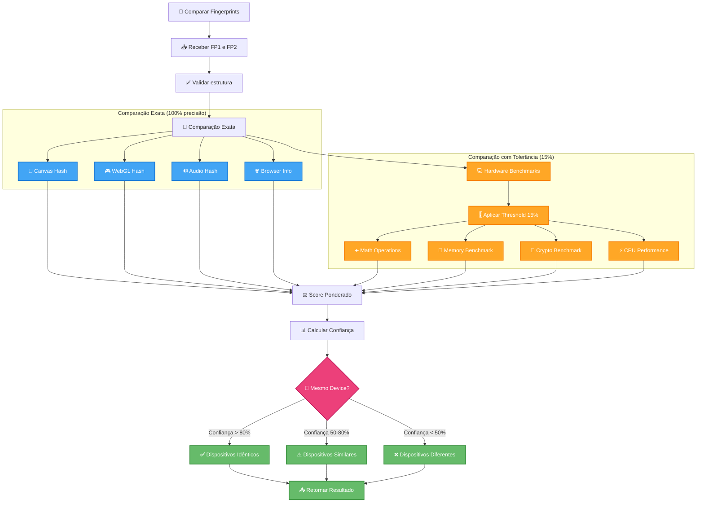

# Sistema de Browser Fingerprinting - Arquitetura e Pipeline

[← Voltar ao README principal](../README.md) | [🌐 Live Demo](https://wasm-fingerprint-78aae8be269e.herokuapp.com/)

Este documento apresenta a arquitetura completa do sistema de browser fingerprinting com diagramas detalhados em Mermaid, incluindo fluxo de dados, pipeline de deployment e correções implementadas.

## Índice

- [Arquitetura Completa](#diagrama-da-arquitetura-completa)
- [Pipeline de Coleta](#pipeline-de-coleta-de-fingerprint)
- [Fluxo de Dados](#fluxo-de-dados-detalhado)
- [Estrutura de Dados](#estrutura-de-dados-do-fingerprint)
- [Sistema de Comparação](#sistema-de-comparação-inteligente)
- [Deployment e DevOps](#deployment-e-devops)
- [Correções Implementadas](#correções-e-melhorias-recentes)

## Diagrama da Arquitetura Completa



## Pipeline de Coleta de Fingerprint



## Fluxo de Dados Detalhado



## Estrutura de Dados do Fingerprint



## Tecnologias e Componentes

### Frontend Stack
- **HTML5/CSS3**: Interface moderna e responsiva
- **Vanilla JavaScript**: Lógica de cliente sem frameworks
- **WebAssembly (Rust)**: Computação de alta performance
- **Web APIs**: Canvas, WebGL, Web Audio, Performance

### Backend Stack
- **Node.js**: Runtime JavaScript no servidor
- **Express.js**: Framework web minimalista
- **SQLite**: Banco de dados embarcado
- **Body Parser/CORS**: Middleware de segurança

### Build Tools
- **Rust/Cargo**: Compilação do código WASM
- **wasm-pack**: Geração de bindings JavaScript
- **npm**: Gerenciamento de dependências Node.js

### Recursos de Segurança
- **COOP/COEP Headers**: Isolamento de origem cruzada
- **Rate Limiting**: Proteção contra spam
- **CORS**: Controle de acesso cross-origin
- **Input Validation**: Sanitização de dados

### Estrutura de Arquivos
```
wasm-finger/
├── 📁 public/              # Assets estáticos
│   ├── 📄 index.html       # Interface principal
│   ├── 📄 help.html        # Documentação
│   └── 📁 pkg/             # WASM gerado
├── 📁 wasm-fingerprint/    # Código Rust
│   ├── 📄 Cargo.toml       # Dependências Rust
│   └── 📁 src/             # Módulos fingerprinting
├── 📁 database/            # Camada de dados
│   ├── 📄 schema.sql       # Estrutura do DB
│   └── 📄 database.js      # Abstração SQLite
├── 📁 config/              # Configurações
│   └── 📄 index.js         # Config centralizada
├── 📁 scripts/             # Scripts de automação
│   └── 📄 deploy-heroku.sh # Deploy automatizado
├── 📁 data/                # Backup em arquivos
├── 📄 server.js            # Servidor Express
├── 📄 .env.production      # Variáveis produção
├── 📄 Procfile             # Config Heroku
├── 📄 app.json             # Heroku app config
└── 📄 package.json         # Dependências Node.js
```

## Sistema de Comparação Inteligente

### Algoritmo de Tolerância para Hardware Benchmarks

O sistema implementa um algoritmo avançado de comparação que considera as variações naturais nos benchmarks de hardware:



### Endpoint de Comparação Inteligente

**POST /api/compare-fingerprints**

```json
{
  "fingerprint1": { /* dados do primeiro fingerprint */ },
  "fingerprint2": { /* dados do segundo fingerprint */ }
}
```

**Resposta:**
```json
{
  "success": true,
  "isMatch": true,
  "confidence": 92.5,
  "details": {
    "canvas": { "match": true, "score": 1.0 },
    "webgl": { "match": true, "score": 1.0 },
    "audio": { "match": true, "score": 1.0 },
    "browser": { "match": true, "score": 1.0 },
    "hardware": {
      "math_operations": { "match": true, "score": 0.87 },
      "memory_benchmark": { "match": true, "score": 0.91 },
      "crypto_benchmark": { "match": true, "score": 0.94 }
    }
  }
}
```

## Deployment e DevOps

### Pipeline de Deploy no Heroku


### Configuração de Ambiente

**Arquivos de Configuração:**
- `.env.production` - Documentação completa das variáveis
- `Procfile` - Configuração de processo Heroku
- `app.json` - Metadata da aplicação
- `scripts/deploy-heroku.sh` - Script automatizado de deploy

**Comandos de Deploy:**
```bash
# Deploy automático
npm run deploy:heroku

# Deploy manual
heroku config:set $(grep -v '^#' .env.production | grep -v '^$' | tr '\n' ' ')
git push heroku main
```

## Correções e Melhorias Recentes

### ✅ Bug Fixes Implementados

1. **Compare Sessions Button Fix**
   - Problema: `event.target` undefined em chamadas programáticas
   - Solução: Parâmetro opcional `targetElement` na função `switchTab()`
   - Status: ✅ Resolvido

2. **Heroku Deployment Issues**
   - Problema: H20 "App boot timeout"
   - Causa: Server binding em `localhost` instead de `0.0.0.0`
   - Solução: Configuração dinâmica de host baseada em `NODE_ENV`
   - Status: ✅ Resolvido

3. **WASM Build na Produção**
   - Problema: `wasm-pack` não disponível no Heroku
   - Solução: Pre-built WASM files incluídos no repositório
   - Script: `build:wasm:heroku` que pula compilação
   - Status: ✅ Resolvido

4. **Session Recognition Issue**
   - Problema: Mesmas sessões detectadas como diferentes
   - Causa: Variações naturais em hardware benchmarks
   - Solução: Sistema de tolerância de 15% para benchmarks
   - Status: ✅ Resolvido

### 🚀 Melhorias de Performance

1. **Intelligent Comparison System**
   - Endpoint `/api/compare-fingerprints` com análise detalhada
   - Scoring ponderado com diferentes pesos por componente
   - Níveis de confiança: Idêntico (>80%), Similar (50-80%), Diferente (<50%)

2. **Database Optimization**
   - Schema normalizado com 8 tabelas relacionadas
   - Índices para queries frequentes
   - Foreign keys para integridade referencial

3. **Configuration Management**
   - Sistema centralizado em `config/index.js`
   - Feature flags para desenvolvimento/produção
   - Validação automática de configuração

### 📊 Analytics e Monitoramento

- Health check endpoint: `/health`
- Estatísticas em tempo real: `/api/stats`
- Logging estruturado em JSON
- Métricas de performance dos benchmarks
